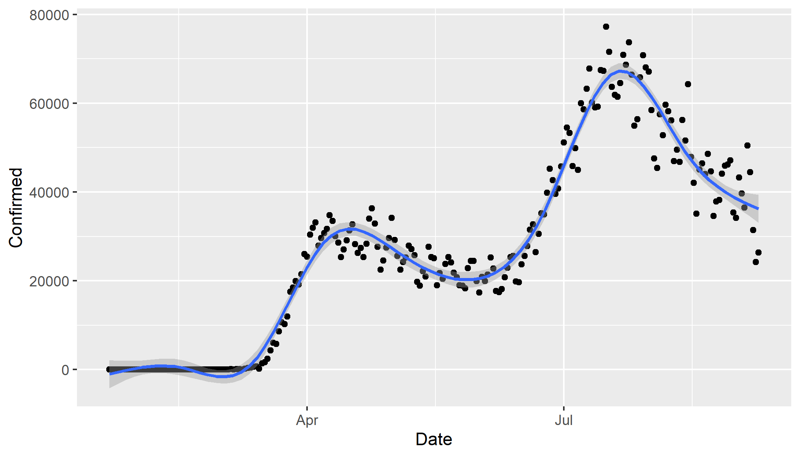

# rawcoviddata
simple R package to read data from publicly available covid data repositories

# installation, using devtools()
devtools::install_github("lmullany/rawcoviddata")

# example usage in R
```r
#load the package
library(rawcoviddata)

#pull the csse data by country and date
global <- cssedataglobal() # pulls the csse data by country and date

#pull the usafacts data
usafactsdata()

#get us/state/county level data, as a list, indicating either usafacts or csse as the source data
us_empirical_by_level("csse")
us_empirical_by_level("usafacts")
```
# notes:
* Only csse or usafacts, as of July 18th, 2020
* When creating list of us/state/county level data using "usafacts", territorial data will be pulled by default from csse

# Example plot generation
```r
library(ggplot2)
library(rawcoviddata)
us <- cssedataglobal()[`Country/Region`=="US"]
ggplot(us, aes(Date,Confirmed)) + geom_point() + geom_smooth(method="gam")
```

