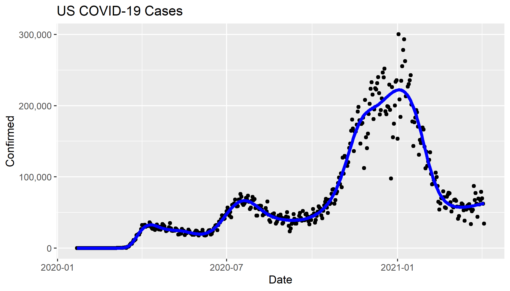

# rawcoviddata

simple R package to read data from publicly available covid data repositories

# installation, using devtools()

devtools::install_github("lmullany/rawcoviddata")

# example usage in R

``` r
#load the package
library(rawcoviddata)

#pull the global csse data by country and date
global <- cssedataglobal() # pulls the csse data by country and date

#pull the usa csse data, setting `return_compact` to TRUE
usa_csse_data = cssedata(return_compact=T)

# This returns a three element list: case data, death data, and population data
# Use helper functions `get_us_from_cdp()`, get_all_states_from_cdp()` or `get_all_counties_from_cdp()`
# to get us, state, and county level information from the compact form of `cssedata()`

# us data
get_us_from_cdp(usa_csse_data,fix_cumul = T)
# state data
get_all_states_from_cdp(usa_csse_data,fix_cumul = T)
# county data
get_all_counties_from_cdp(usa_csse_data,fix_cumul = T)

```

# notes:

-   Only csse or usafacts, as of July 18th, 2020
-   When creating list of us/state/county level data using "usafacts", territorial data will be pulled by default from csse

# example plot generation (knots placed every 21 days)

``` r
library(rawcoviddata)
us <- cssedataglobal()[`Country/Region`=="US"]
plot_covid(us) + 
  ggplot2::ggtitle("US COVID-19 Cases") + 
  ggplot2::scale_y_continuous(labels=scales::comma)
```


